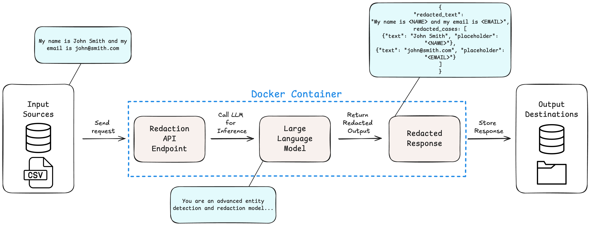

# Redacting Sensitive Information with LLMs



This project presents a lightweight, on-premise redaction system that leverages open-source large language models (LLMs) to identify and redact sensitive information without relying on fine-tuning or proprietary APIs. The system is designed as a modular, Dockerized application that exposes a local API, allowing seamless integration into organizational workflows while preserving data locality and privacy. Using prompting alone, the system demonstrates strong redaction performance on a 5,000-example subset of the PII-200k benchmark dataset. Empirical results show that the Gemma 3 12B model significantly outperforms the 4B variant in both redaction accuracy and formatting adherence, with reasonable runtime and high inference stability. While limitations remain in generalization, domain adaptation, and runtime efficiency, the system’s architecture supports horizontal scalability and practical deployment on consumer-grade hardware. All code, prompts, and evaluation configurations are made publicly available to support reproducibility and further development. 

For a deeper look into the design philosophy, system architecture, experimental setup, and broader discussion, the full project write-up is available here:  
📄 [**AI Redaction Project Write-Up (PDF)**](./AI_Redaction_Writeup.pdf)

---

## 📦 Project Structure
```
ai-redaction/
│
├── README.md                      # Main project overview
├── Dockerfile                     # Docker file to build application
├── requirements.txt               # Python dependencies
├── AI_Redaction_Writeup.pdf       # Full project write-up (PDF)
├── Workflow_Diagram.png           # High-level workflow process diagram
│
├── app/                           # FastAPI backend application
│   ├── __init__.py
│   ├── database.py                # Database connection setup
│   ├── inference.py               # Redaction inference logic 
│   ├── main.py                    # FastAPI app entrypoint
│   ├── schemas.py                 # Pydantic schemas for API request/response
│
├── database/                      # Database model definitions (SQLite3)
│   ├── __init__.py
│   ├── models.py                
│
├── experiments/                   # Benchmark experiments and evaluation
│   ├── data/                      # Benchmark datasets
│   │   ├── benchmark_data.csv     
│   │   ├── pii_200k.csv
│   ├── gemma3_4b/                 # Experiment outputs for Gemma 3 4B model
│   │   ├── redacted_errors.csv
│   │   ├── redacted_outputs.csv
│   │   ├── evaluation_results.csv
│   ├── gemma3_12b/                # Experiment outputs for Gemma 3 12B model
│   │   ├── redacted_errors.csv
│   │   ├── redacted_outputs.csv
│   │   ├── evaluation_results.csv
│   ├── scripts/                       # Scripts for experiments
│   │   └── extract_benchmark_data.py  # Extract benchmark data
│   │   ├── run_redaction.py           # Run model inference
│   │   ├── evaluate_redactions.py     # Calculate evaluation metrics
│
├── models/                        # Ollama Modelfiles for local models
│   ├── gemma3_4b/
│   │   ├── Modelfile
│   │   └── README.md
│   ├── gemma3_12b/
│   │   ├── Modelfile
│   │   └── README.md
│
├── scripts/                      
│   ├── send_redact_request.py     # Send request to the /redact endpoint
```

--- 

## 🚀 Quick Start

### 1. Install Ollama and Docker
Make sure [Ollama](https://ollama.com/) and [Docker](https://www.docker.com/) are installed on your computer. 

### 2. Create Ollama models
```bash
ollama create redaction:4b -f ./models/gemma3_4b/Modelfile.txt 
ollama create redaction:12b -f ./models/gemma3_4b/Modelfile.txt 
```
- `ollama list` to verify models were built
- `ollama serve` to verify ollama is running


### 3. Build the Docker image 
```bash
docker build -t ai-redaction -f ./Dockerfile .    
```

### 4. Run the FastAPI Server using the Docker container
```bash
docker run -d -p 8000:8000 ai-redaction
```
The API will be available at `http://localhost:8000/`.

### 5. Test FastAPI Application
- Navigate to `http://localhost:8000/docs`. 
- Click on the `/redact` dropdown
- Press `Try it out`
- Send requests 
- Or run `python scripts/send_redact_request.py` 

---

## ⚠️ Disclaimer

This project is provided for research, educational, and experimental purposes only. While efforts have been made to design the redaction system responsibly, no guarantees are provided regarding the completeness, accuracy, or security of the redactions performed. Users are responsible for independently verifying the suitability of this system for their specific use cases, especially in applications involving sensitive personal information, privacy compliance, or regulatory obligations.

This redaction framework was developed independently and is not affiliated with or owned by any organization. It was built using open-source tools, public datasets, and personal compute resources. No proprietary data or infrastructure was used in its development. Organization-specific adaptations may exist as private integrations but do not affect ownership of the core system.

The author(s) assume no liability for any damages, losses, or legal consequences arising from the use or misuse of this project.

---

## 📚 Citation

If you use this work in your research or publications, please cite it appropriately.  
You can reference it as:

> Redacting Sensitive Information with Large Language Models:
A Practical System Design and Evaluation, Jordan Larot, April 2025. GitHub Repository: github.com/jordanlarot/ai-redaction

(Or adapt it according to your specific citation format.)

Thank you for your support!

## 📜 License

The source code for this project is released under the MIT License.  

This project makes use of the following external components:

- **Gemma 3 model** provided through [Ollama](https://ollama.com/library/gemma3). Usage of the model is subject to its own license terms, available [here](https://ollama.com/library/gemma3/blobs/dd084c7d92a3).
- **Docker** is required to build and run the application containers. Docker is a third-party platform licensed under the Apache 2.0 License. You are responsible for complying with Docker’s terms of use. More information can be found at [Docker Licensing](https://www.docker.com/legal/docker-terms-service/).

Please review the linked licenses for any third-party components.  

This project does not bundle Docker or Docker Engine itself — it assumes Docker is separately installed on your system.

---

## 📬 Contact

If you have any questions, feedback, or inquiries regarding this project, please feel free to reach out:

- **Name:** Jordan Larot
- **Email:** jordan@larot.ai

I’m happy to discuss the project, potential collaborations, or related research ideas.